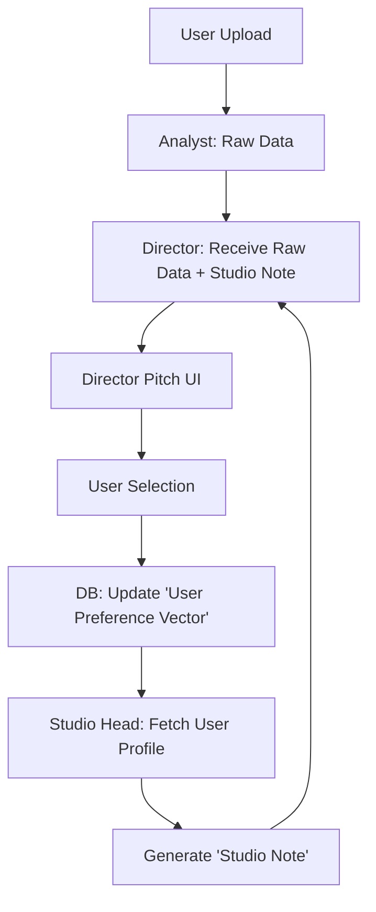

# The Grand Scheme: Axiomatic & Constitutional Architecture
**Project:** Longevity Valley Brand Content Factory
**Status:** The "Soul" Definition
**Target Audience:** Lead Engineer (Claude Opus), Systems Architect (Gemini)

---

## 1. THE AXIOMATIC LEVEL (The "Why")
*Immutable truths that define the system's purpose. These cannot be violated.*

### Axiom 1: Radical User Alignment
> "The System exists solely to manifest the User's Latent Vision."
>
> *   **Implication:** If the User's choice contradicts the AI's Logic Score, the AI is wrong. The System must update its weights to align with the User's "Hidden Spec."

### Axiom 2: Contextual Sovereignty
> "Brand Identity is the border that cannot be crossed."
>
> *   **Implication:** Adaptation has limits. The System can adapt *Style* (Vibe) but never *Truth* (Logic/Integrity). A Director cannot hallucinate a new logo just to satisfy a "Creative" prompt.

### Axiom 3: Evolutionary Plasticity
> "The System must learn from every interaction."
>
> *   **Implication:** Static prompts are technical debt. The "Studio Head" must constantly refine the "Studio Notes" based on aggregate User Behavior (The Box Office).

---

## 2. THE CONSTITUTIONAL LEVEL (The "Rules")
*The governance structure that enforces the Axioms.*

### Article I: The Separation of Powers
To prevent hallucinations and bias, we split the "Brain" into three distinct agents:

1.  **The Analyst (The Eye):** Purely objective. Sees pixels, colors, text. (Gemini 2.5 Flash).
    *   *Mandate:* "Report what is there. Do not interpret."
2.  **The Director (The Voice):** Purely subjective. Interprets data through a "Persona."
    *   *Mandate:* "Sell a vision. Be opinionated. Take risks based on your Profile."
3.  **The Studio Head (The Guide):** Purely adaptive. Injects historical context.
    *   *Mandate:* "Prime the Director. Whisper the User's preferences before the pitch."

### Article II: The "Mirror" Validation
Before any code merge or deployment, the **Adaptation Capability** must be proven.
*   **The Test:** Can "The Visionary" sound like "The Engineer" if ordered to?
*   **The Rule:** If an Agent becomes too rigid (ignoring the Studio Note), it is considered "Defective" and fails CI/CD.

---

## 3. THE OPERATIONAL LEVEL (The "Code")
*How this translates to TypeScript logic.*

### 3.1 The Adaptive Feedback Loop
We move from a Linear Workflow to a Circular Workflow.

### 3.2 The "Studio Note" Injection (Technical Spec)
In `vision.ts`, the System Prompt construction must follow this hierarchy:

1.  **Base Instructions:** "You are an AI..." (Weakest)
2.  **Persona Definition:** "You are The Newtonian..." (Strong)
3.  **The Studio Note (Context):** "User prefers short, punchy text..." (Strongest - **The Override**)

*Critical Code Requirement:* The Studio Note must be injected *last* in the prompt context window to ensure Recency Bias favors user preference.

### 3.3 The "Drift" Prevention (The Mirror Test)
The `scripts/test-adaptation.ts` script acts as the "Constitutional Court."
*   It mocks a "Radical Studio Note" (e.g., telling a Serious Director to be Funny).
*   If the output does not shift significantly, the model is flagged as "Rigid."
*   **Action:** We increase the prompt weight of the Studio Note until plasticity is restored.

---

## 4. EXECUTION DIRECTIVES FOR CLAUDE (Lead Engineer)

1.  **Do not over-engineer the Database.** Use a simple JSONB column `user_preferences` on the `users` table. We do not need a Vector DB yet.
2.  **Focus on the "Handshake."** The interface between *Studio Head* and *Director* is just a string (The Note). Keep it text-based for explainability.
3.  **Respect the Integrity Gate.** Even if the User wants "Chaos," the `integrityScore` (from the Analyst) serves as a hard veto for quality.

---

**End of Document**
